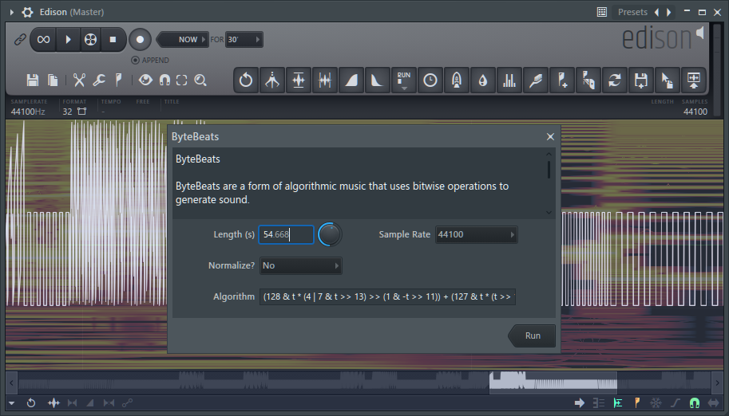

# Project Name

## Description

This collection of scripts is designed for use with Image Line’s audio editor, Edison. While the scripts don’t target specific use cases, they offer a variety of functionalities. Some scripts focus heavily on sample preparation and automation, streamlining sampling processes. Others serve as generators or experimental tools, providing weird and creative possibilities.

You need Edison to run these scripts. It comes with Image Line's FL Studio.

The scripts ar located here on Windows:

`C:\Users\[windows user profile]\Documents\Image-Line\FL Studio\Settings\Audio scripts`



## Dev info

Install [Python](https://www.python.org/).

```bash
pipenv install
```

```bash
pipenv install fl-studio-api-stubs
```

```bash
pipenv update fl-studio-api-stubs
```

## Scripts

### Generators

#### Noise generator

Genereators/Noise Generator.pyscript

Bytebeat is a genre of music that creates rhythmic and somewhat melodic sounds without traditional scores, instruments, or oscillators. Instead, it uses a simple formula to define a waveform as a function of time, typically measured in 1/8000 of a second.

#### ByteBeats

Genereators/ByteBeats.pyscript

Bytebeat is a genre of music that creates rhythmic and somewhat melodic sounds without traditional scores, instruments, or oscillators. Instead, it uses a simple formula to define a waveform as a function of time, typically measured in 1/8000 of a second.

## Dump

Since there isn't much information available about the API / Objects, here is some additional data derived from extracting details about the objects.

### ScriptDialog attributes and methods:

```text
AddInput: <method 'AddInput' of 'ScriptDialog' objects>

AddInputCheckbox: <method 'AddInputCheckbox' of 'ScriptDialog' objects>

AddInputCombo: <method 'AddInputCombo' of 'ScriptDialog' objects>

AddInputKnob: <method 'AddInputKnob' of 'ScriptDialog' objects>

AddInputKnobInt: <method 'AddInputKnobInt' of 'ScriptDialog' objects>

AddInputSurface: <method 'AddInputSurface' of 'ScriptDialog' objects>

AddInputText: <method 'AddInputText' of 'ScriptDialog' objects>

Execute: <method 'Execute' of 'ScriptDialog' objects>

GetInputValue: <method 'GetInputValue' of 'ScriptDialog' objects>

SetText: <method 'SetText' of 'ScriptDialog' objects>

**class**: <class 'type'>
**delattr**: <slot wrapper '**delattr**' of 'object' objects>
**dir**: <method '**dir**' of 'object' objects>
**doc**: None
**eq**: <slot wrapper '**eq**' of 'object' objects>
**format**: <method '**format**' of 'object' objects>
**ge**: <slot wrapper '**ge**' of 'object' objects>
**getattribute**: <slot wrapper '**getattribute**' of 'object' objects>
**getstate**: <method '**getstate**' of 'object' objects>
**gt**: <slot wrapper '**gt**' of 'object' objects>
**hash**: <slot wrapper '**hash**' of 'object' objects>
**init**: <slot wrapper '**init**' of 'ScriptDialog' objects>
**init_subclass**: <built-in method **init_subclass** of type object at 0x00000000124E9D60>
**le**: <slot wrapper '**le**' of 'object' objects>
**lt**: <slot wrapper '**lt**' of 'object' objects>
**ne**: <slot wrapper '**ne**' of 'object' objects>
**new**: <built-in method **new** of type object at 0x00000000124E9D60>
**reduce**: <method '**reduce**' of 'object' objects>
**reduce_ex**: <method '**reduce_ex**' of 'object' objects>
**repr**: <slot wrapper '**repr**' of 'object' objects>
**setattr**: <slot wrapper '**setattr**' of 'object' objects>
**sizeof**: <method '**sizeof**' of 'object' objects>
**str**: <slot wrapper '**str**' of 'object' objects>
**subclasshook**: <built-in method **subclasshook** of type object at 0x00000000124E9D60>
addGroup: <method 'addGroup' of 'ScriptDialog' objects>
addInput: <method 'addInput' of 'ScriptDialog' objects>
addInputCheckbox: <method 'addInputCheckbox' of 'ScriptDialog' objects>
addInputCombo: <method 'addInputCombo' of 'ScriptDialog' objects>
addInputKnob: <method 'addInputKnob' of 'ScriptDialog' objects>
addInputKnobInt: <method 'addInputKnobInt' of 'ScriptDialog' objects>
addInputSurface: <method 'addInputSurface' of 'ScriptDialog' objects>
addInputText: <method 'addInputText' of 'ScriptDialog' objects>
endGroup: <method 'endGroup' of 'ScriptDialog' objects>
execute: <method 'execute' of 'ScriptDialog' objects>
getInputValue: <method 'getInputValue' of 'ScriptDialog' objects>
restoreFormValues: <member 'restoreFormValues' of 'ScriptDialog' objects>
setNormalizedValue: <method 'setNormalizedValue' of 'ScriptDialog' objects>
setText: <method 'setText' of 'ScriptDialog' objects>
```

### Region attributes and methods

```text
Copy: <method 'Copy' of 'enveditor.Region' objects>

Info: <attribute 'Info' of 'enveditor.Region' objects>

KeyNum: <attribute 'KeyNum' of 'enveditor.Region' objects>

Name: <attribute 'Name' of 'enveditor.Region' objects>

SampleEnd: <attribute 'SampleEnd' of 'enveditor.Region' objects>

SampleStart: <attribute 'SampleStart' of 'enveditor.Region' objects>

Time: <attribute 'Time' of 'enveditor.Region' objects>

**class**: <class 'type'>
**delattr**: <slot wrapper '**delattr**' of 'object' objects>
**dir**: <method '**dir**' of 'object' objects>
**doc**: None
**eq**: <slot wrapper '**eq**' of 'object' objects>
**format**: <method '**format**' of 'object' objects>
**ge**: <slot wrapper '**ge**' of 'object' objects>
**getattribute**: <slot wrapper '**getattribute**' of 'object' objects>
**getstate**: <method '**getstate**' of 'object' objects>
**gt**: <slot wrapper '**gt**' of 'object' objects>
**hash**: <slot wrapper '**hash**' of 'object' objects>
**init**: <slot wrapper '**init**' of 'object' objects>
**init_subclass**: <built-in method **init_subclass** of type object>
**le**: <slot wrapper '**le**' of 'object' objects>
**lt**: <slot wrapper '**lt**' of 'object' objects>
**module**: enveditor
**ne**: <slot wrapper '**ne**' of 'object' objects>
**new**: <built-in method **new** of type object>
**reduce**: <method '**reduce**' of 'object' objects>
**reduce_ex**: <method '**reduce_ex**' of 'object' objects>
**repr**: <slot wrapper '**repr**' of 'object' objects>
**setattr**: <slot wrapper '**setattr**' of 'object' objects>
**sizeof**: <method '**sizeof**' of 'object' objects>
**str**: <slot wrapper '**str**' of 'object' objects>
**subclasshook**: <built-in method **subclasshook** of type object>
```

Sample attributes and methods:

```text
AddRegion: <method 'AddRegion' of 'enveditor.Sample' objects>

AmpFromTo: <method 'AmpFromTo' of 'enveditor.Sample' objects>

CenterFromTo: <method 'CenterFromTo' of 'enveditor.Sample' objects>

ConvertToMono: <method 'ConvertToMono' of 'enveditor.Sample' objects>

DeleteFromTo: <method 'DeleteFromTo' of 'enveditor.Sample' objects>

DeleteRegion: <method 'DeleteRegion' of 'enveditor.Sample' objects>

GetRegion: <method 'GetRegion' of 'enveditor.Sample' objects>

GetSampleAt: <method 'GetSampleAt' of 'enveditor.Sample' objects>

GetSamplesAt: <method 'GetSamplesAt' of 'enveditor.Sample' objects>

InsertSilence: <method 'InsertSilence' of 'enveditor.Sample' objects>

Length: <attribute 'Length' of 'enveditor.Sample' objects>

LoadFromClipboard: <method 'LoadFromClipboard' of 'enveditor.Sample' objects>

LoadFromFile: <method 'LoadFromFile' of 'enveditor.Sample' objects>

LoadFromFile_Ask: <method 'LoadFromFile_Ask' of 'enveditor.Sample' objects>

MSToSamples: <method 'MSToSamples' of 'enveditor.Sample' objects>

NoiseFromTo: <method 'NoiseFromTo' of 'enveditor.Sample' objects>

NormalizeFormat: <method 'NormalizeFormat' of 'enveditor.Sample' objects>

NormalizeFromTo: <method 'NormalizeFromTo' of 'enveditor.Sample' objects>

NumChans: <attribute 'NumChans' of 'enveditor.Sample' objects>

PasteFromTo: <method 'PasteFromTo' of 'enveditor.Sample' objects>

RegionCount: <attribute 'RegionCount' of 'enveditor.Sample' objects>

ReverseFromTo: <method 'ReverseFromTo' of 'enveditor.Sample' objects>

ReversePolarityFromTo: <method 'ReversePolarityFromTo' of 'enveditor.Sample' objects>

SampleRate: <attribute 'SampleRate' of 'enveditor.Sample' objects>

SamplesToMS: <method 'SamplesToMS' of 'enveditor.Sample' objects>

SetSampleAt: <method 'SetSampleAt' of 'enveditor.Sample' objects>

SetSamplesAt: <method 'SetSamplesAt' of 'enveditor.Sample' objects>

SilenceFromTo: <method 'SilenceFromTo' of 'enveditor.Sample' objects>

SineFromTo: <method 'SineFromTo' of 'enveditor.Sample' objects>

SwapChannelsFromTo: <method 'SwapChannelsFromTo' of 'enveditor.Sample' objects>

TrimFromTo: <method 'TrimFromTo' of 'enveditor.Sample' objects>

**class**: <class 'type'>
**delattr**: <slot wrapper '**delattr**' of 'object' objects>
**dir**: <method '**dir**' of 'object' objects>
**doc**: None
**eq**: <slot wrapper '**eq**' of 'object' objects>
**format**: <method '**format**' of 'object' objects>
**ge**: <slot wrapper '**ge**' of 'object' objects>
**getattribute**: <slot wrapper '**getattribute**' of 'object' objects>
**getstate**: <method '**getstate**' of 'object' objects>
**gt**: <slot wrapper '**gt**' of 'object' objects>
**hash**: <slot wrapper '**hash**' of 'object' objects>
**init**: <slot wrapper '**init**' of 'enveditor.Sample' objects>
**init_subclass**: <built-in method **init_subclass** of type object>
**le**: <slot wrapper '**le**' of 'object' objects>
**lt**: <slot wrapper '**lt**' of 'object' objects>
**module**: enveditor
**ne**: <slot wrapper '**ne**' of 'object' objects>
**new**: <built-in method **new** of type object>
**reduce**: <method '**reduce**' of 'object' objects>
**reduce_ex**: <method '**reduce_ex**' of 'object' objects>
**repr**: <slot wrapper '**repr**' of 'object' objects>
**setattr**: <slot wrapper '**setattr**' of 'object' objects>
**sizeof**: <method '**sizeof**' of 'object' objects>
**str**: <slot wrapper '**str**' of 'object' objects>
**subclasshook**: <built-in method **subclasshook** of type object>
```

EditorSample attributes and methods:

```text
AddRegion: <built-in method AddRegion of enveditor.Sample object>

AmpFromTo: <built-in method AmpFromTo of enveditor.Sample object>

CenterFromTo: <built-in method CenterFromTo of enveditor.Sample object>

ConvertToMono: <built-in method ConvertToMono of enveditor.Sample object>

DeleteFromTo: <built-in method DeleteFromTo of enveditor.Sample object>

DeleteRegion: <built-in method DeleteRegion of enveditor.Sample object>

GetRegion: <built-in method GetRegion of enveditor.Sample object>

GetSampleAt: <built-in method GetSampleAt of enveditor.Sample object>

GetSamplesAt: <built-in method GetSamplesAt of enveditor.Sample object>

InsertSilence: <built-in method InsertSilence of enveditor.Sample object>

Length: 367

LoadFromClipboard: <built-in method LoadFromClipboard of enveditor.Sample object>

LoadFromFile: <built-in method LoadFromFile of enveditor.Sample object>

LoadFromFile_Ask: <built-in method LoadFromFile_Ask of enveditor.Sample object>

MSToSamples: <built-in method MSToSamples of enveditor.Sample object>

NoiseFromTo: <built-in method NoiseFromTo of enveditor.Sample object>

NormalizeFormat: <built-in method NormalizeFormat of enveditor.Sample object>

NormalizeFromTo: <built-in method NormalizeFromTo of enveditor.Sample object>

NumChans: 1

PasteFromTo: <built-in method PasteFromTo of enveditor.Sample object>

RegionCount: 0

ReverseFromTo: <built-in method ReverseFromTo of enveditor.Sample object>

ReversePolarityFromTo: <built-in method ReversePolarityFromTo of enveditor.Sample object>

SampleRate: 48000

SamplesToMS: <built-in method SamplesToMS of enveditor.Sample object>

SetSampleAt: <built-in method SetSampleAt of enveditor.Sample object>

SetSamplesAt: <built-in method SetSamplesAt of enveditor.Sample object>

SilenceFromTo: <built-in method SilenceFromTo of enveditor.Sample object>

SineFromTo: <built-in method SineFromTo of enveditor.Sample object>

SwapChannelsFromTo: <built-in method SwapChannelsFromTo of enveditor.Sample object>

TrimFromTo: <built-in method TrimFromTo of enveditor.Sample object>

**class**: <class 'enveditor.Sample'>
**delattr**: <method-wrapper '**delattr**' of enveditor.Sample object>
**dir**: <built-in method **dir** of enveditor.Sample object>
**doc**: None
**eq**: <method-wrapper '**eq**' of enveditor.Sample object>
**format**: <built-in method **format** of enveditor.Sample object>
**ge**: <method-wrapper '**ge**' of enveditor.Sample object>
**getattribute**: <method-wrapper '**getattribute**' of enveditor.Sample object>
**getstate**: <built-in method **getstate** of enveditor.Sample object>
**gt**: <method-wrapper '**gt**' of enveditor.Sample object>
**hash**: <method-wrapper '**hash**' of enveditor.Sample object>
**init**: <method-wrapper '**init**' of enveditor.Sample object>
**init_subclass**: <built-in method **init_subclass** of type object>
**le**: <method-wrapper '**le**' of enveditor.Sample object>
**lt**: <method-wrapper '**lt**' of enveditor.Sample object>
**module**: enveditor
**ne**: <method-wrapper '**ne**' of enveditor.Sample object>
**new**: <built-in method **new** of type object>
**reduce**: <built-in method **reduce** of enveditor.Sample object>
**reduce_ex**: <built-in method **reduce_ex** of enveditor.Sample object>
**repr**: <method-wrapper '**repr**' of enveditor.Sample object>
**setattr**: <method-wrapper '**setattr**' of enveditor.Sample object>
**sizeof**: <built-in method **sizeof** of enveditor.Sample object>
**str**: <method-wrapper '**str**' of enveditor.Sample object>
**subclasshook**: <built-in method **subclasshook** of type object>
```

MEEditor attributes and methods:

```text
SelectionEndS: <attribute 'SelectionEndS' of 'enveditor.MEEditor' objects>

SelectionStartS: <attribute 'SelectionStartS' of 'enveditor.MEEditor' objects>

**class**: <class 'type'>
**delattr**: <slot wrapper '**delattr**' of 'object' objects>
**dir**: <method '**dir**' of 'object' objects>
**doc**: None
**eq**: <slot wrapper '**eq**' of 'object' objects>
**format**: <method '**format**' of 'object' objects>
**ge**: <slot wrapper '**ge**' of 'object' objects>
**getattribute**: <slot wrapper '**getattribute**' of 'object' objects>
**getstate**: <method '**getstate**' of 'object' objects>
**gt**: <slot wrapper '**gt**' of 'object' objects>
**hash**: <slot wrapper '**hash**' of 'object' objects>
**init**: <slot wrapper '**init**' of 'object' objects>
**init_subclass**: <built-in method **init_subclass** of type object>
**le**: <slot wrapper '**le**' of 'object' objects>
**lt**: <slot wrapper '**lt**' of 'object' objects>
**module**: enveditor
**ne**: <slot wrapper '**ne**' of 'object' objects>
**new**: <built-in method **new** of type object>
**reduce**: <method '**reduce**' of 'object' objects>
**reduce_ex**: <method '**reduce_ex**' of 'object' objects>
**repr**: <slot wrapper '**repr**' of 'object' objects>
**setattr**: <slot wrapper '**setattr**' of 'object' objects>
**sizeof**: <method '**sizeof**' of 'object' objects>
**str**: <slot wrapper '**str**' of 'object' objects>
**subclasshook**: <built-in method **subclasshook** of type object>
```

Editor attributes and methods:

```text
SelectionEndS: 366

SelectionStartS: 0

**class**: <class 'enveditor.MEEditor'>
**delattr**: <method-wrapper '**delattr**' of enveditor.MEEditor object>
**dir**: <built-in method **dir** of enveditor.MEEditor object>
**doc**: None
**eq**: <method-wrapper '**eq**' of enveditor.MEEditor object>
**format**: <built-in method **format** of enveditor.MEEditor object>
**ge**: <method-wrapper '**ge**' of enveditor.MEEditor object>
**getattribute**: <method-wrapper '**getattribute**' of enveditor.MEEditor object>
**getstate**: <built-in method **getstate** of enveditor.MEEditor object>
**gt**: <method-wrapper '**gt**' of enveditor.MEEditor object>
**hash**: <method-wrapper '**hash**' of enveditor.MEEditor object>
**init**: <method-wrapper '**init**' of enveditor.MEEditor object>
**init_subclass**: <built-in method **init_subclass** of type object>
**le**: <method-wrapper '**le**' of enveditor.MEEditor object>
**lt**: <method-wrapper '**lt**' of enveditor.MEEditor object>
**module**: enveditor
**ne**: <method-wrapper '**ne**' of enveditor.MEEditor object>
**new**: <built-in method **new** of type object>
**reduce**: <built-in method **reduce** of enveditor.MEEditor object>
**reduce_ex**: <built-in method **reduce_ex** of enveditor.MEEditor object>
**repr**: <method-wrapper '**repr**' of enveditor.MEEditor object>
**setattr**: <method-wrapper '**setattr**' of enveditor.MEEditor object>
**sizeof**: <built-in method **sizeof** of enveditor.MEEditor object>
**str**: <method-wrapper '**str**' of enveditor.MEEditor object>
**subclasshook**: <built-in method **subclasshook** of type object>
```

Utils attributes and methods:

```text
ProgressMsg: <built-in method ProgressMsg of enveditor.Utils object>

ShowMessage: <built-in method ShowMessage of enveditor.Utils object>

**class**: <class 'enveditor.Utils'>
**delattr**: <method-wrapper '**delattr**' of enveditor.Utils object>
**dir**: <built-in method **dir** of enveditor.Utils object>
**doc**: None
**eq**: <method-wrapper '**eq**' of enveditor.Utils object>
**format**: <built-in method **format** of enveditor.Utils object>
**ge**: <method-wrapper '**ge**' of enveditor.Utils object>
**getattribute**: <method-wrapper '**getattribute**' of enveditor.Utils object>
**getstate**: <built-in method **getstate** of enveditor.Utils object>
**gt**: <method-wrapper '**gt**' of enveditor.Utils object>
**hash**: <method-wrapper '**hash**' of enveditor.Utils object>
**init**: <method-wrapper '**init**' of enveditor.Utils object>
**init_subclass**: <built-in method **init_subclass** of type object>
**le**: <method-wrapper '**le**' of enveditor.Utils object>
**lt**: <method-wrapper '**lt**' of enveditor.Utils object>
**module**: enveditor
**ne**: <method-wrapper '**ne**' of enveditor.Utils object>
**new**: <built-in method **new** of type object>
**reduce**: <built-in method **reduce** of enveditor.Utils object>
**reduce_ex**: <built-in method **reduce_ex** of enveditor.Utils object>
**repr**: <method-wrapper '**repr**' of enveditor.Utils object>
**setattr**: <method-wrapper '**setattr**' of enveditor.Utils object>
**sizeof**: <built-in method **sizeof** of enveditor.Utils object>
**str**: <method-wrapper '**str**' of enveditor.Utils object>
**subclasshook**: <built-in method **subclasshook** of type object>
```
